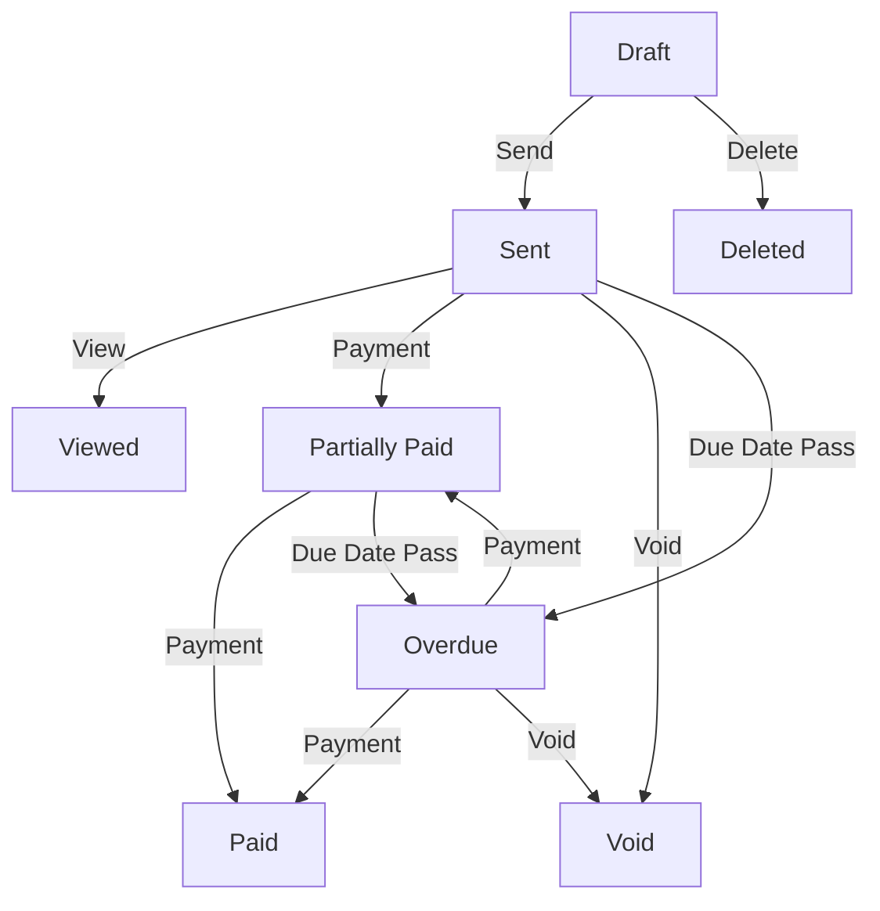
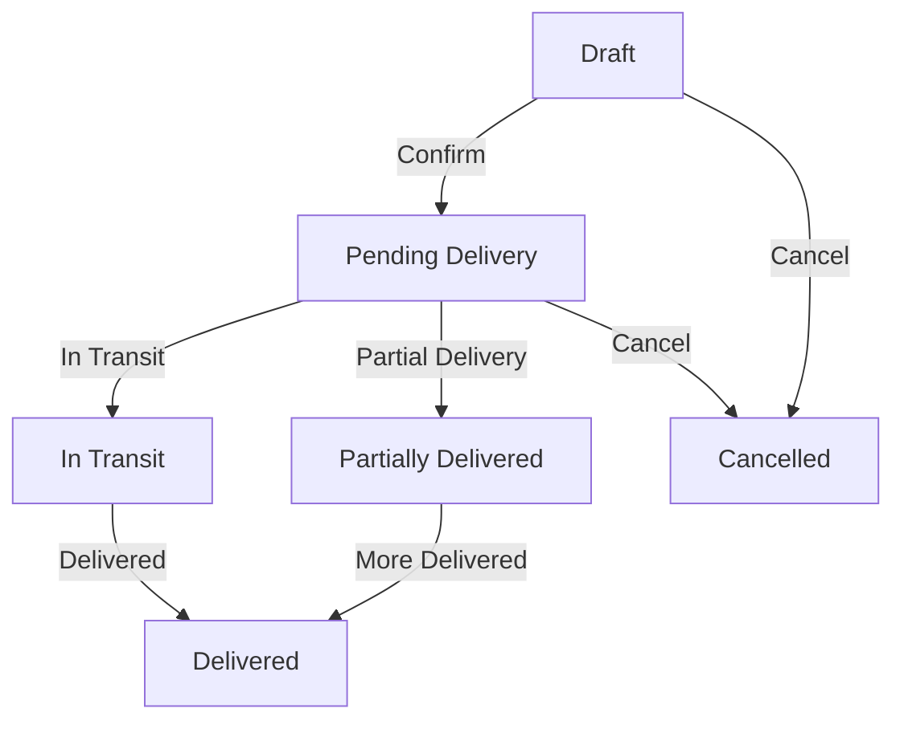

# Module Documentation - Detailed Analysis

**Document Date**: March 1, 2026

## Table of Contents

1. [Finance Module](#finance-module)
2. [Procurement Module](#procurement-module)
3. [HRM Module](#hrm-module)
4. [Auth Management Module](#auth-management-module)
5. [Core Module](#core-module)
6. [Business Module](#business-module)
7. [CRM Module](#crm-module)
8. [Notifications Module](#notifications-module)

---

## FINANCE MODULE

**Path**: `finance/`  
**Status**: ⭐⭐⭐⭐⭐ Mature and Comprehensive  
**Estimated Coverage**: 40%

### Architecture

```
finance/
├── invoicing/          # Core invoicing functionality
│   ├── models.py       # Invoice, DeliveryNote, CreditNote, etc.
│   ├── serializers.py  # Order serializers
│   ├── views.py        # ViewSets for API endpoints
│   ├── filters.py      # DjangoFilter definitions
│   ├── admin.py        # Django admin configuration
│   └── urls.py         # URL routing
├── payment/            # Payment processing
│   ├── models.py       # Payment model
│   ├── serializers.py  # Payment serializers
│   └── views.py        # Payment endpoints
├── accounts/           # Chart of accounts
├── budgets/            # Budget management
├── cashflow/           # Cash flow analysis
├── expenses/           # Expense tracking
├── quotations/         # Sales quotations
├── reconciliation/     # Bank reconciliation
├── taxes/              # Tax calculations
├── analytics/          # Financial reporting
├── services/           # Business logic services
├── api.py              # Centralized API configuration
├── urls.py             # Module URL routing
├── utils.py            # Utility functions
└── pdf_generator.py    # PDF report generation
```

### Key Models

#### 1. Invoice
**Purpose**: Billable transaction documents  
**Parent Class**: BaseOrder

**Fields**:
- `invoice_number`: CharField (unique, auto-generated)
- `invoice_date`: DateField
- `due_date`: DateField
- `status`: CharField (choices: draft, sent, viewed, paid, overdue, cancelled, void)
- `payment_terms`: CharField (choices: due_on_receipt, net_15, net_30, net_60, custom)
- `custom_terms_days`: PositiveIntegerField (for custom terms)
- `amount_paid`: DecimalField
- `balance_due`: DecimalField (computed)
- `source_quotation`: ForeignKey('quotations.Quotation')
- `requires_approval`: BooleanField
- `approval_status`: CharField
- `approved_by`: ForeignKey(User)
- `approved_at`: DateTimeField
- `is_recurring`: BooleanField
- `recurring_interval`: CharField (weekly, monthly, quarterly, yearly)
- `next_invoice_date`: DateField
- `sent_at`: DateTimeField
- `viewed_at`: DateTimeField
- `last_reminder_sent`: DateTimeField
- `reminder_count`: PositiveIntegerField

**Relationships**:
- `customer`: ForeignKey(Contact, related_name='invoices')
- `branch`: ForeignKey(Branch, related_name='invoices')
- `items`: Reverse relation from OrderItem (generic)
- `invoice_payments`: Reverse relation from InvoicePayment
- `payments`: Reverse relation from Payment
- `email_logs`: Reverse relation from InvoiceEmailLog
- `credit_notes`: Reverse relation from CreditNote
- `debit_notes`: Reverse relation from DebitNote
- `dn_from_invoice`: Reverse relation from DeliveryNote

**Key Methods**:
```python
def generate_invoice_number():
    """Generate unique invoice number using DocumentNumberService"""
    
def recalculate_payments(user=None):
    """Sync totals with actual InvoicePayment records"""
    
def record_payment(amount, payment_date, payment_account, user=None):
    """Record a payment against the invoice"""
    
def void_invoice(reason=None):
    """Mark invoice as void"""
    
def clone_invoice():
    """Create a copy of the invoice"""
    
def send_reminder():
    """Send payment reminder to customer"""
```

#### 2. DeliveryNote
**Purpose**: Document confirming delivery of goods  
**Parent Class**: BaseOrder

**Fields**:
- `delivery_note_number`: CharField (unique, auto-generated)
- `delivery_date`: DateField
- `status`: CharField (draft, pending, in_transit, delivered, partially_delivered, cancelled)
- `delivery_address`: TextField
- `driver_name`: CharField
- `driver_phone`: CharField
- `vehicle_number`: CharField
- `received_by`: CharField
- `received_at`: DateTimeField
- `receiver_signature`: ImageField
- `special_instructions`: TextField

**Relationships**:
- `source_invoice`: ForeignKey(Invoice, null=True, blank=True)
- `source_purchase_order`: ForeignKey(PurchaseOrder, null=True, blank=True)
- `customer`: ForeignKey(Contact)
- `supplier`: ForeignKey(Contact, null=True)
- `items`: Reverse relation from OrderItem

**Key Methods**:
```python
@classmethod
def create_from_invoice(cls, invoice, created_by=None, delivery_address=None):
    """Factory method to create delivery note from invoice"""
    
@classmethod
def create_from_purchase_order(cls, purchase_order, created_by=None):
    """Factory method to create delivery note from PO"""
    
def mark_delivered(received_by=None, notes=None):
    """Mark delivery note as delivered"""
    
def generate_delivery_note_number():
    """Generate unique delivery note number"""
```

#### 3. CreditNote
**Purpose**: Invoice adjustments due to returns or discounts  
**Parent Class**: BaseOrder

**Fields**:
- `credit_note_number`: CharField (unique, auto-generated)
- `credit_note_date`: DateField
- `reason`: TextField
- `status`: CharField (draft, issued, applied, void)

**Relationships**:
- `source_invoice`: ForeignKey(Invoice, related_name='credit_notes')

#### 4. DebitNote
**Purpose**: Additional charges added to invoice  
**Parent Class**: BaseOrder

**Fields**:
- `debit_note_number`: CharField (unique, auto-generated)
- `debit_note_date`: DateField
- `reason`: TextField
- `status`: CharField (draft, issued, applied, void)

**Relationships**:
- `source_invoice`: ForeignKey(Invoice, related_name='debit_notes')

#### 5. ProformaInvoice
**Purpose**: Pre-invoice quotations/estimates  
**Parent Class**: BaseOrder

**Similar fields and relationships to Invoice**

### Serializers

#### InvoiceSerializer
- **Purpose**: Full invoice data with related objects
- **Use Case**: Comprehensive API responses
- **Key Fields**:
  - `invoice_number`, `invoice_date`, `due_date`
  - `customer_details` (nested ContactSerializer)
  - `items` (nested OrderItemSerializer)
  - `balance_due_display`, `is_overdue`, `days_until_due`
  - `current_approver_id`, `pending_approvals`

#### InvoiceCreateSerializer
- **Purpose**: Creating/updating invoices
- **Writable Fields**: customer, branch, dates, totals, items
- **Items**: InvoiceItemCreateSerializer (write-only)

#### DeliveryNoteSerializer
- **Purpose**: Full delivery note data
- **Key Fields**: All model fields plus related objects
- **Read-only**: Generated numbers, timestamps

#### DeliveryNoteCreateSerializer
- **Purpose**: Creating delivery notes from invoices
- **Factory Method**: `create_from_invoice()` using source data

### API ViewSets

#### InvoiceViewSet
**Base Class**: BaseModelViewSet  
**URL**: `/api/invoices/`

**Available Actions**:
- `GET /invoices/` - List invoices (paginated, filtered)
- `POST /invoices/` - Create invoice
- `GET /invoices/{id}/` - Retrieve invoice details
- `PATCH /invoices/{id}/` - Update invoice
- `DELETE /invoices/{id}/` - Delete invoice (if draft)
- `POST /invoices/{id}/send/` - Send invoice to customer
- `POST /invoices/{id}/schedule-send/` - Schedule invoice send
- `POST /invoices/{id}/mark-paid/` - Record payment
- `POST /invoices/{id}/void/` - Void invoice
- `GET /invoices/{id}/pdf/` - Generate PDF
- `GET /invoices/{id}/email-logs/` - Get email tracking

**Query Parameters**:
- `status`: Filter by status
- `customer_id`: Filter by customer
- `invoice_date_from`, `invoice_date_to`: Date range
- `ordering`: Sort by field
- `page`: Pagination

#### DeliveryNoteViewSet
**Base Class**: BaseModelViewSet  
**URL**: `/api/delivery-notes/`

**Available Actions**:
- `GET /delivery-notes/` - List delivery notes
- `POST /delivery-notes/` - Create delivery note
- `GET /delivery-notes/{id}/` - Retrieve details
- `PATCH /delivery-notes/{id}/` - Update
- `POST /delivery-notes/{id}/from-invoice/` - Create from invoice
- `POST /delivery-notes/{id}/mark-delivered/` - Confirm delivery
- `GET /delivery-notes/{id}/pdf/` - Generate PDF

### Workflows

#### Invoice Lifecycle


#### Delivery Note Lifecycle


### Common Operations

#### Create Invoice
```python
POST /api/invoices/
{
    "customer": 123,
    "branch": 456,
    "invoice_date": "2026-03-01",
    "payment_terms": "net_30",
    "items": [
        {
            "product_id": 789,
            "quantity": 5,
            "unit_price": "100.00"
        }
    ]
}
```

#### Create Delivery Note from Invoice
```python
POST /api/delivery-notes/
{
    "source_invoice": 123,
    "delivery_address": "123 Main St",
    "driver_name": "John Doe",
    "vehicle_number": "ABC-123"
}
```

#### Record Payment
```python
POST /api/invoices/{id}/record-payment/
{
    "amount": "500.00",
    "payment_date": "2026-03-01",
    "payment_account": 456,
    "notes": "Check #12345"
}
```

### PDF Generation
- Uses ReportLab/WeasyPrint
- Includes company logo, invoice details, line items, totals
- Watermark for draft status
- QR code for document tracking (future enhancement)

### Known Issues & Gaps

| Issue | Severity | Status | Fix |
|-------|----------|--------|-----|
| DeliveryNote-Invoice integration incomplete | HIGH | Open | Implement fulfillment tracking |
| No line-item fulfillment tracking | HIGH | Open | Add fulfillment model |
| Missing invoice approval workflow | MEDIUM | Open | Implement state machine |
| PDF generation may miss details | MEDIUM | Open | Enhanced PDF template |
| No signature validation | LOW | Open | Add signature verification |

---

## PROCUREMENT MODULE

**Path**: `procurement/`  
**Status**: ⭐⭐⭐⭐ Good  
**Estimated Coverage**: 25%

### Architecture

```
procurement/
├── orders/             # Purchase orders
├── purchases/          # Purchase management
├── requisitions/       # Procurement requests
├── contracts/          # Supplier contracts
├── supplier_performance/
├── analytics/
├── services/
├── workflows.py        # Workflow state machine (EXISTS)
├── urls.py
└── utils.py
```

### Key Models

#### PurchaseOrder
**Parent Class**: BaseOrder

**Fields**:
- `order_number`: CharField (auto-generated)
- `status`: Choice field (draft, submitted, approved, ordered, received, cancelled)
- `requisition`: OneToOneField('ProcurementRequest', optional)
- `approved_budget`: DecimalField
- `actual_cost`: DecimalField
- `delivery_instructions`: TextField
- `expected_delivery`: DateField
- `approved_at`: DateTimeField
- `ordered_at`: DateTimeField
- `received_at`: DateTimeField
- `approved_by`: ForeignKey(User)

**Relationships**:
- `supplier`: ForeignKey(Contact, related_name='purchase_orders')
- `branch`: ForeignKey(Branch)
- `approvals`: ManyToManyField('approvals.Approval')
- `items`: Reverse from OrderItem

**Key Methods**:
```python
def approve_order(approved_by_user):
    """Approve the purchase order"""
    
def mark_received(received_by=None):
    """Mark order as received"""
    
def generate_order_number():
    """Generate unique PO number via DocumentNumberService"""
```

#### ProcurementRequest
**Purpose**: Internal purchase request initiating procurement process  
**Status**: Draft → Submitted → Approved → Converted to PO

### Workflows

**File**: `procurement/workflows.py`

Defines state transitions for procurement process:
- Draft → Submitted
- Submitted → Approved
- Submitted → Rejected
- Approved → Ordered
- Ordered → Received
- Any → Cancelled

### Known Issues & Gaps

| Issue | Severity | Status |
|-------|----------|--------|
| workflows.py coverage unclear | MEDIUM | Needs review |
| Limited supplier performance metrics | MEDIUM | Enhancement needed |
| No contract compliance checking | HIGH | Feature gap |
| PO to DeliveryNote link incomplete | HIGH | Integration gap |
| Error scenarios not well defined | MEDIUM | Documentation needed |

---

## HRM MODULE

**Path**: `hrm/`  
**Status**: ⭐⭐⭐⭐ Good  
**Estimated Coverage**: 20%

### Architecture

```
hrm/
├── employees/          # Employee records and management
├── payroll/            # Salary processing
├── leave/              # Leave management and balances
├── attendance/         # Attendance tracking
├── recruitment/        # Hiring and recruitment
├── training/           # Training programs and tracking
├── performance/        # Performance reviews
├── appraisals/         # Employee appraisals
├── reports/            # HR reports and analytics
├── analytics/
├── api.py
├── urls.py
└── utils/
```

### Key Models

#### Employee
- Personal information
- Department and job title
- Salary information
- Employment status
- Manager relationships

#### Payroll
- Salary structure
- Deductions (taxes, insurance)
- Allowances (transport, housing)
- Gross and net pay calculation

#### Leave
- Leave types (annual, sick, personal)
- Leave balance tracking
- Leave request workflow
- Approval chain

#### Attendance
- Check-in/check-out times
- Late/early departure tracking
- Attendance reports

#### Recruitment
- Job postings
- Job applications
- Interview tracking
- Hiring decisions

### Known Issues & Gaps

| Issue | Severity | Status |
|-------|----------|--------|
| Limited test coverage for payroll | HIGH | Testing needed |
| Date edge cases (leap years) | MEDIUM | Needs handling |
| Limited finance integration | MEDIUM | Integration gap |
| Missing advanced reporting | MEDIUM | Feature gap |
| Kenya-specific tax rules may be outdated | MEDIUM | Maintenance needed |

---

## AUTH MANAGEMENT MODULE

**Path**: `authmanagement/`  
**Status**: ⭐⭐⭐⭐⭐ Secure and Comprehensive  
**Estimated Coverage**: 70%

### Architecture

```
authmanagement/
├── models.py           # User extension, roles, permissions
├── serializers.py      # Auth serializers
├── views.py            # Auth endpoints (login, register, etc.)
├── backends.py         # Custom auth backends
├── middleware.py       # Auth middlewares
├── security.py         # Security utilities
├── services/           # Auth services
├── urls.py
└── templates/          # Email templates for auth
```

### Key Features

#### Authentication
- JWT token-based authentication
- Token refresh mechanism
- Custom authentication backends
- User model extension

#### Authorization
- Role-based access control (RBAC)
- Permission-based endpoint security
- Group-based access management
- Custom permission checks

#### Security
- Password hashing (PBKDF2)
- CSRF protection
- CORS configuration
- Rate limiting on login

#### Middleware
- Request authentication
- Permission enforcement
- Security headers
- Request/response logging

### Strengths
- Strong security foundation
- Comprehensive permission system
- Well-tested (70% coverage)
- Clear authentication flow

### Enhancement Opportunities
- OAuth2/Social login
- API key authentication
- Advanced rate limiting
- MFA implementation
- Login audit logging

---

## CORE MODULE

**Path**: `core/`  
**Status**: ⭐⭐⭐⭐ Excellent Foundation  
**Estimated Coverage**: 50%

### Architecture

```
core/
├── models.py                # Base models, audit trail, metrics
├── serializers.py           # BaseOrderSerializer
├── base_viewsets.py         # BaseModelViewSet
├── views.py
├── urls.py
├── utils.py                 # Utility functions
├── decorators.py            # Performance monitoring
├── middleware.py            # Request processing
├── pagination.py            # Pagination classes
├── response.py              # Standardized responses
├── cache.py                 # Caching utilities
├── currency.py              # Multi-currency support
├── audit.py                 # Audit trail system
├── metrics.py               # Performance metrics
├── exceptions.py            # Custom exceptions
├── validators.py            # Custom validators
├── security.py              # Security utilities
├── file_security.py         # File upload validation
├── image_optimization.py     # Image processing
├── background_jobs.py       # Celery task definitions
├── load_testing.py          # Load testing utilities
├── analytics/               # Analytics functionality
├── modules/                 # Module implementations
├── middleware/              # Middleware classes
├── tests/                   # Core tests
└── management/              # Management commands
```

### Key Components

#### 1. BaseModel (Abstract)
```python
class BaseModel(models.Model):
    created_at = models.DateTimeField(auto_now_add=True)
    updated_at = models.DateTimeField(auto_now=True)
    
    class Meta:
        abstract = True
```

#### 2. BaseOrderSerializer
- Base serializer for all order types
- Includes customer/supplier details
- Handles item serialization
- Computes derived fields

#### 3. BaseModelViewSet
- Extended ModelViewSet with:
  - Automatic query optimization
  - Pagination support
  - Filtering and search
  - Standardized response format
  - Error handling

#### 4. AuditTrail Model
```python
class AuditTrail(BaseModel):
    operation = CharField(choices: CREATE, UPDATE, DELETE)
    module = CharField
    entity_type = CharField
    entity_id = IntegerField
    user = ForeignKey(User)
    changes = JSONField
    reason = TextField
```

#### 5. Performance Decorators
- `@track_performance`: Monitor function execution time
- `@cache_result`: Cache function results
- `@log_audit`: Log operations to audit trail

#### 6. Pagination Classes
- `StandardResultsSetPagination`: Standard offset pagination
- `CursorPagination`: Cursor-based pagination for large datasets

### Utilities

#### DocumentNumberService
```python
# Generate unique document numbers
DocumentNumberService.generate_number(
    business=business,
    document_type=DocumentType.INVOICE,
    document_date=datetime.now()
)
```

#### CurrencyConverter
```python
# Multi-currency support
converter.convert(amount, from_currency, to_currency)
```

#### Common Functions
- `get_user_branch()`: Get user's primary branch
- `get_user_business()`: Get user's business
- `paginate_queryset()`: Apply pagination
- `filter_queryset()`: Apply filters and search

### Strengths
- Excellent base classes and mixins
- Comprehensive utility library
- Well-documented patterns
- Reusable components

### Enhancement Opportunities
- More comprehensive type hints
- Additional utility functions
- Better error messages
- Extended documentation

---

## BUSINESS MODULE

**Path**: `business/`  
**Status**: ⭐⭐⭐ Adequate  
**Estimated Coverage**: 30%

### Key Models

#### Bussiness ⚠️ (Misspelled - should be "Business")
- Company information
- Business details and configuration
- Registration information

#### Branch
- Company branch/location
- Business association
- Department hierarchy

#### Departments
- Organizational structure
- Reporting relationships
- Function assignments

### Issues
- **Naming**: "Bussiness" class is misspelled, fixing would require migration
- **Limited Features**: Basic structure, limited business logic
- **Documentation**: Sparse docstrings
- **Validation**: Limited business rule enforcement

---

## CRM MODULE

**Path**: `crm/`  
**Status**: ⭐⭐⭐ Basic Implementation  
**Estimated Coverage**: 30%

### Key Models

#### Contact (Unified Model)
- Customer or supplier contact
- Email, phone, address information
- Business relationship tracking

### Limitations
- Missing opportunity tracking
- No sales pipeline
- Limited activity logging
- Basic contact information only
- No integration with Finance for customer history
- No activity timeline

### Enhancement Opportunities
- Opportunity/lead management
- Activity tracking
- Customer health scores
- Sales pipeline visualization
- Communication history

---

## NOTIFICATIONS MODULE

**Path**: `notifications/`  
**Status**: ⭐⭐⭐⭐ Well-Implemented  
**Estimated Coverage**: 60%

### Features

#### Email Sending
- Template-based emails
- HTML and text versions
- Bulk send capability
- Email logging

#### SMS Notifications
- Africa's Talking integration
- Message templates
- Delivery tracking

#### Push Notifications
- Firebase Cloud Messaging
- Device registration
- Notification preferences

#### Email Logging
- Track sent emails
- Record open rates
- Track clicks
- Delivery status

### Email Templates
Located in: `notifications/templates/notifications/email/`
- `invoice_sent.html` - Invoice delivery notification
- `payment_reminder.html` - Payment reminders
- `order_confirmation.html` - Order confirmations
- etc.

### Known Issues
- Limited bounce handling
- Basic retry logic
- No rate limiting for sends
- Missing user preferences

---

## Summary Table

| Module | Purpose | Status | Coverage | Priority |
|--------|---------|--------|----------|----------|
| **Finance** | Invoicing, payments | ⭐⭐⭐⭐⭐ | 40% | HIGH |
| **Procurement** | Purchase orders | ⭐⭐⭐⭐ | 25% | HIGH |
| **HRM** | Employee management | ⭐⭐⭐⭐ | 20% | MEDIUM |
| **Auth** | Authentication | ⭐⭐⭐⭐⭐ | 70% | LOW |
| **Core** | Shared utilities | ⭐⭐⭐⭐ | 50% | MEDIUM |
| **Business** | Company structure | ⭐⭐⭐ | 30% | LOW |
| **CRM** | Customer relations | ⭐⭐⭐ | 30% | MEDIUM |
| **Notifications** | Communications | ⭐⭐⭐⭐ | 60% | MEDIUM |

---

**Document Version**: 1.0  
**Last Updated**: 2026-03-01  
**Author**: Audit Team
